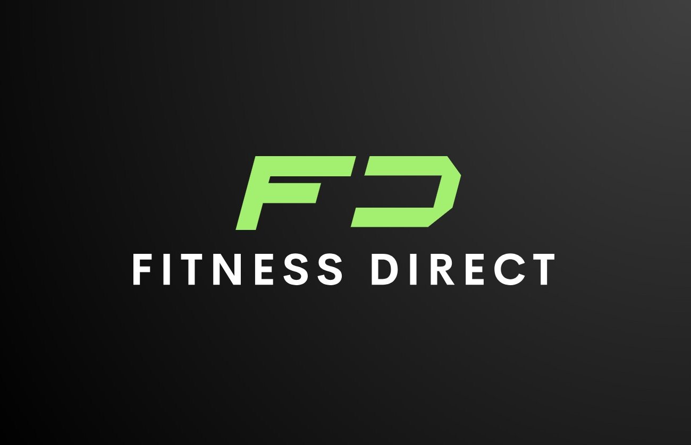

# Fitness Direct




# Table of Contents
- [Description](#Description-of-project)
- [User story](#User-story)
- [Acceptance criteria](#Acceptance-criteria)
- [Project features](#Project-features)
- [Project-implentations](#Project-implentations)
- [Screenshot of website](#Screenshot-of-application)
- [Links](#Links)
- [Contributors](#Contributors)
- [Licence](#Licence)
- [Credits](#Credits)


# Description-of-project
Fitness Direct is a fullstack application created to provide users a way to shop for all fitness related products to help reach all fitness goals.

Implementing technologies like React, GraphQL with Node.js and Express.js server to create a unique interface, Fitness Direct was originally developed to support all users through their fitness journey. Shopping for fitness accesories can be overwhelming, whether you are a beginner or a seasoned athlete, Fitness Direct uses a bright, engaging and user friendly interface to cater to all. Met with an extensive product catalog, users can browse and checkout securely and achieve their fitness goals with Fitness Direct.

# User-story
```md
AS A USER
I WANT to create an account and shop for fitness products
SO THAT I can look for items in my selected category
```

# Acceptance-criteria

```md
GIVEN use of Fitness Direct
WHEN user is presented with the homepage
THEN they are able to view the different shopping categories
WHEN clicking or viewing an item, user is able to able to add to shopping cart
THEN user is able to view and edit (remove or increase item number) items in shoping cart
WHEN new user signs up to Fitness Direct
THEN user is able to login and checkout with those details
WHEN exisiting user abandons cart
THEN user is sent an email to complete checkout
WHEN user checkouts on the the shopping basket
THEN they are able to checkout using stripe interface
WHEN the payment is successful
THEN the order will be appeared in order history and the quantity of stocks will be reduced
```

# Project-features
- Extensive Product Catalog: Browse through a selection of fitness equipment, from cardio machines to strength training gear, yoga accessories, and more. 
- User-Friendly Interface: Easy-to-navigate and engaing website for users.
- Abandoned Cart: Existing users are sent a 'continue shopping' email from Fitness Direct to complete checkout.


# Project-implentations
- Front-end: React was mainly implemented for front-end.
- Bank-end: GraphQL with Node.js and Express.js server and MongoDB and the Mongoose ODM for the database.
- Deployment: Heroku with data, see [Links](#Links), for link to deployment.
- Potential improvements: Add amount of people that have purchased the item in the previous hour when clicking on item.


# Screenshot-of-application


# Links
```md
Link to deployed application: 

https://coders-of-doom-c91c338dc92f.herokuapp.com/

Link to GitHub Repository: 

https://github.com/percivalho/Coders-of-Doom.git
```

# Contributors
Team contributors:

- (https://github.com/percivalho)
- (https://github.com/Adam-Smart)
- (https://github.com/Hasan0412)
- (https://github.com/ahs456)


# Licence
N/A


# Credits
- Stripe website gradient effect: https://kevinhufnagl.com/how-to-stripe-website-gradient-effect/
